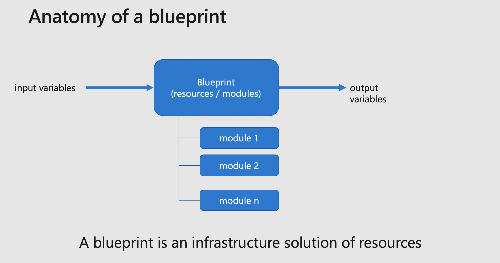

# Introduction to blueprints

Welcome to Azure Terraform blueprints repository.

A blueprint is a reusable architecture element that will be leveraged by a landing zone to form a complete environment to deploy and manage an application.

Blueprints are key part in landing zone service composition as they are invoked as modules, taking input variables, and exporting output variables that will be reused by other blueprints, within a given landing zone:

Blueprints are also key in repeatability and reusability, for example, when you deploy a new region inside your Azure environment, you can create a very similar deployment in the new environment, by leveraging the same blueprint, with different variables.  

Examples of blueprints are:

- Image gallery
- Dual Region AKS cluster
- Flat network topology
- Network hub-spoke topology: shared services, ingress DMZ, egress DMZ, transit DMZ, etc.
- Shared management services
- Azure DevOps

## Common blueprints

Whether your are deploying an environment for a cloud migration, deploying a ML/AI, or a Web application, you will always leverage the some blueprints, those are called *foundations* and are to be present in probably all new environment you are creating

Name | Feature |  
------- | ----------------
foundation_accounting  | logging and accounting for a subscription.
foundation_security  | security and security hygiene components configuration.

## Using blueprints

You typically will not deploy blueprints directly but will call them from a landing zones which will connect its elements to other blueprints and resources.

## Contribute

Pull requests are welcome to evolve the framework and integrate new features.
